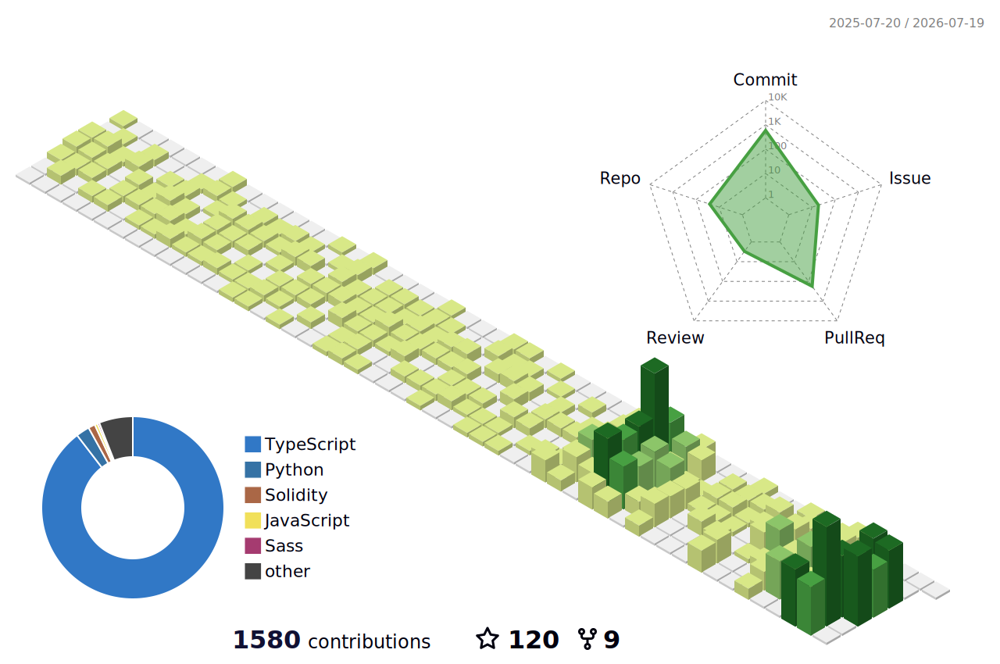
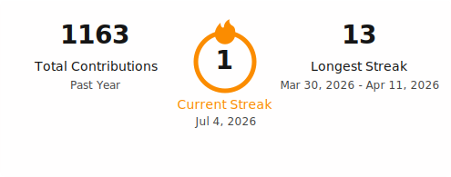

<h1 align="center">
  
</h1>

[Email Me](mailto:crownelf4@gmail.com) | [Portfolio](https://sato-takeru.netlify.app)

---

## ⚡ Philosophy

> "Clean code. Fast execution. Real impact."

---

## 👋 About Me
I am a Senior Software Engineer with 10+ years of experience in **ERP systems, full-stack web development, and AI-powered applications**. I have progressed from **Frontend Developer to CTO**, leading engineering teams and delivering scalable enterprise solutions. I am passionate about **building efficient, high-performance software** and exploring new AI technologies.

---

## 🛠 Core Expertise
- ERP Systems Development  
- Full-Stack Web Development (React, Angular, Node.js, Django)  
- AI Integration & Automation  
- Software Architecture & Scalability  
- Technical Leadership & Team Management  
- Agile Development & Product Delivery  

---

## 💻 Technical Skills

**Languages:** JavaScript / TypeScript | Python | Java | C / C++ | C# | SQL  
**Frontend:** React | Angular | Next.js | HTML5 | CSS | Tailwind CSS  
**Backend:** Node.js | Express | Python | Django | Flask | FastAPI  
**Databases:** PostgreSQL | MySQL | MongoDB  
**Testing:** Playwright | Cypress | Mocha | Jest | Chai  
**Tools & Platforms:** Git/GitHub/GitLab | Docker | Linux | CI/CD  

---

## 📫 Contact Me

- Email: [crownelf4@gmail.com](mailto:crownelf4@gmail.com)  
- Portfolio: [https://sato-takeru.netlify.app](https://sato-takeru.netlify.app)  
- GitHub: [https://github.com/GeorgeLxL](https://github.com/GeorgeLxL)  

---

## 📊 GitHub Stats

  <picture>
    <source media="(prefers-color-scheme: dark)" srcset="./profile-3d-contrib/profile-night-rainbow.svg" />
    
  </picture>

<!-- 

  

 -->

  <picture>
    <source media="(prefers-color-scheme: dark)" srcset="./profile/streak-dark.svg" />
    
  </picture>

